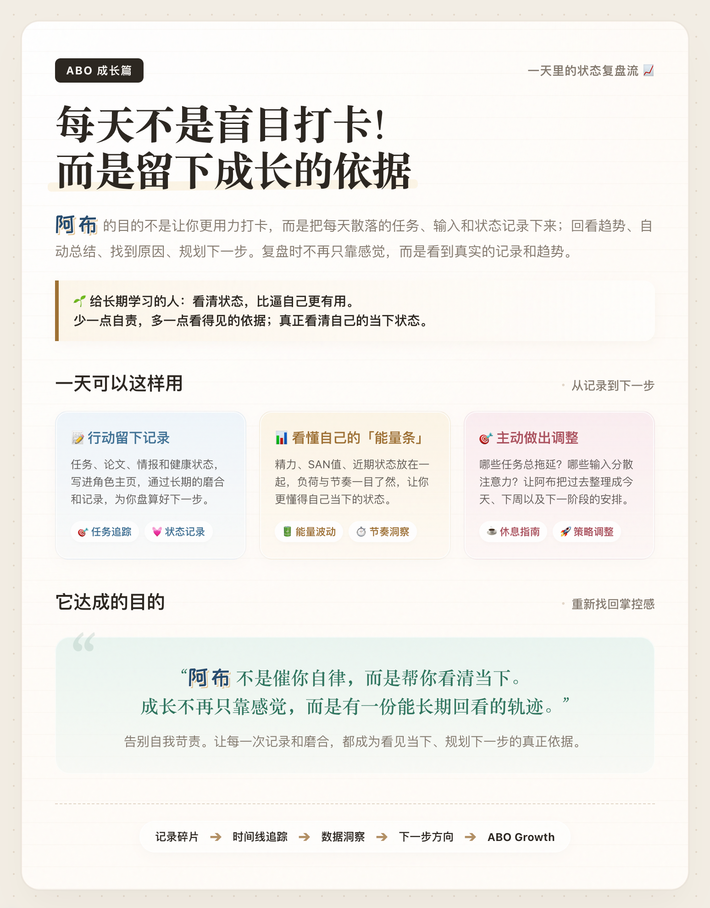
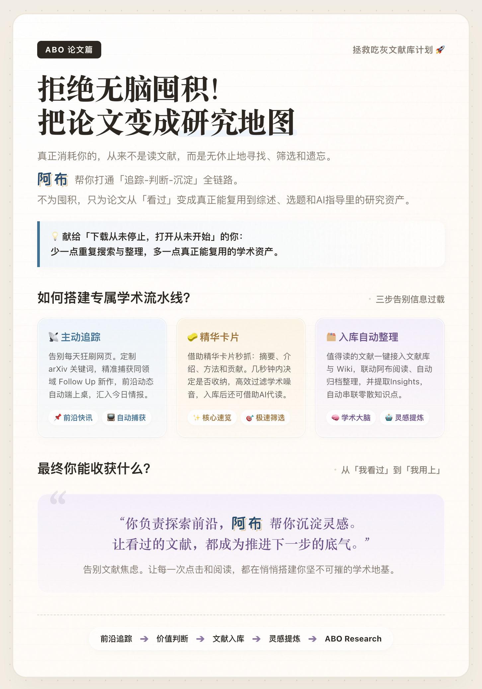

# ABO (阿布) - Another Brain Odyssey

> **“你负责探索世界，阿布帮你记住重要的事情。”** 🌍⚔️👑 **把散落的输入，变成一个本地、持续、可沉淀的第二大脑。**

**ABO（阿布）** ，你的“地球OL”专属向导🗺️，也是一场属于你“第二大脑”的奥德赛之旅👣。

它不是单纯的网页爬虫，也不是简单将内容搬进笔记软件的工具。ABO 致力于将你散落的输入，转化为一个本地、持续、可回顾的个人信息系统**（All in one, All in Obsidian）**。

在这个时代，我们最不缺的就是信息，最缺的是沉淀。阿布想做的，就是把你每天追踪的论文、吃灰的收藏，以及当下的状态彻底打通，让它们不再是散落的碎片，**而是真正变成你可回看、可复用、可拓展的个人资产，同时阿布助手也会帮你做系统性的维护和整理，彻底解放双手。**


## 有趣人生可视化……

把输入收进来、整理好后，阿布能很好的基于本地数据做一些有趣的人生可视化……

1. `历史兴趣点迁移图`
   根据不同时间段导入的小红书收藏、B 站收藏夹、关注流和论文主题，画出你的兴趣如何从一个主题迁移到另一个主题，从数据的角度体现你心境的变化，比如，可能是从生活区到文学区。

2. `当下生活的突破词`
   结合最近收藏内容、手记关键词、任务状态和情绪记录，识别你当前被什么问题、情绪或主题包围，以及最近出现了哪些可能带来“突围舒适圈”的新输入。分析你的当下状态，给你推荐可以进一步成长的尝试，与你此时跃跃欲试的心境契合。

3. `周期性注意力地图`
   把一周内、一个月内、一个季度内反复出现的主题画出来，观察你的注意力究竟是短期热点驱动，还是在围绕几个长期母题循环深化。

4. `Data driven式自主科研`
   通过对于关键词，关键论文的定向追踪，实现自动化的课题整理，形式完整脉络的wiki。

5. `灵感共振时刻`
   识别不同来源在接近时间里同时指向同一主题的时刻，例如某篇论文、一个 B 站视频和几条小红书收藏都在推你关注同一个问题，这种共振点往往最值得沉淀进 Wiki。

6. `个人主题宇宙`
   从长期积累的数据中生成你的主题网络：哪些主题是中心恒星，哪些只是短暂划过的兴趣流星，哪些正在从边缘走向核心，你真的懂得哪些事情，让摄取过的信息都变成你的知识库。

7. `状态剖面`
   用更准确的数据去说清楚你的成长，而不是只能靠感觉，是否每天往自己想成为的人更靠近一点点。

还有很多这种随着进一步体验和使用反馈，才会慢慢浮现出来的有趣东西……


## ABO 做了什么

很多人的问题不是“没有输入”，而是输入太分散：

- 收藏越来越多，但很少真正回看，缺少系统整理。
- 论文下载了很多，但还记得的论文太少。
- 每天有任务、情绪、精力和健康波动，却很难看见长期规律。
- Obsidian 或本地笔记库里有材料，但缺少持续维护和再利用。

ABO 的目标，是把这些散落输入重新拉回本地，让它们经过筛选、保存、归类、Wiki 化和助手分析，逐渐变成属于你自己的研究资产、注意力资产和成长轨迹。

## 核心功能与数据流

ABO 的功能不是一组孤立页面，而是一条从输入到沉淀再到复用的数据流。

```text
外部输入 -> 主动工具 -> 模块管理 -> 今日情报 -> 情报库 / 文献库 / 手记 -> Wiki -> 助手 / 数据洞察 / 角色主页
```

三条主链可以理解为：

```text
注意力链：平台输入 -> 今日情报 -> 情报库 / Wiki -> 长期注意力画像
研究链：论文发现 -> 今日情报 -> 文献库 / Wiki -> 助手生成判断与 idea
成长链：个人记录 -> 手记 / 数据洞察 -> 角色主页 -> 下一步建议
```

## 三条典型使用路径

```text
情报路径：聚合收藏 / 关注流 / 关键词 -> 今日情报 -> 情报库 -> Internet Wiki -> 长期偏好复盘
论文路径：arXiv / Follow Up -> 今日情报 -> 文献库 -> Literature Wiki -> 助手提炼 idea
成长路径：任务 / 手记 / 状态记录 -> 数据洞察 -> 角色主页 -> 周期复盘 -> 下一步安排
```

## 第一次使用建议

第一次使用 ABO，不需要一次配置所有能力。建议先走一条小而完整的链路：

1. 选择一个本地目录作为情报库和文献库，最好是你愿意长期使用的 Obsidian Vault。
2. 先连接小红书或 B 站 Cookie，手动导入少量收藏或关注流内容。
3. 在今日情报里筛选卡片，保存几条真正有价值的内容。
4. 到情报库确认内容已经写入本地。
5. 再尝试生成或更新 Wiki 页面。
6. 最后让助手基于这些本地材料做总结、对比或下一步计划。

如果你主要做研究，可以从论文追踪开始：先用 arXiv 搜索或 Follow Up 追踪保存少量论文，再进入文献库和 Literature Wiki。

## 一句话总结

我们的slogan是：**“你负责探索世界，阿布帮你记住重要的事情。”**

在这个信息过载的时代，和阿布一起，共同维护你的专属个人据点吧～。


如果你准备好搭建自己的专属精神据点，直接下载软件快速上手吧🚀；

如果需要了解更进一步的完整功能和开发思路，请阅读 [ABO 完整指南](docs/abo-user-guide.md)。

## 阿布的自我介绍

<p align="center">
  
  
  
</p>
<p align="center">
  
  
</p>


## 具体使用配置

安装这两个 [obsidian ](https://obsidian.md/)和 [codex](https://chatgpt.com/zh-Hans-CN/codex/) 依赖：

```bash
brew install --cask obsidian
brew install --cask codex
codex login
```

- `Obsidian`：用于创建或打开本地 Vault，后续把 ABO 的情报库和文献库指到这个目录。
- `Codex`：用于助手能力；安装后先执行一次 `codex login`。

### 小红书配置

小红书一键测试：

```bash
bash scripts/xhs/open_browser_with_extension.sh
```

它会启动独立浏览器 profile，并加载 `extension/` 下的小红书 bridge 扩展。首次使用时，在这个浏览器实例里登录小红书即可。

若一键测试不行则手动加载：

```text
./extension
```

以 Chrome / Edge 为例（开发者使用的是Edge）：

1. 打开浏览器扩展管理页。
2. 开启“开发者模式”。
3. 选择“加载已解压的扩展程序”。
4. 选择本仓库下的 `extension` 目录。
5. 在同一个浏览器里登录小红书，再回到 ABO 配置 Cookie 或运行小红书工具。

## 继续调试开发

如果你只是想了解 ABO 的功能，读到这里就够了。下面是给继续开发和本地调试的人看的最小说明。

### 环境准备

建议本机具备：

- `Python 3.11+`
- `Node.js 20+`
- `Rust` 与 `Tauri` 开发环境
- 已登录小红书的 `Edge` 或 `Chrome`
- 一个长期沉淀内容的本地目录，最好是 `Obsidian Vault`

### 安装依赖

```bash
npm install
python3 -m pip install -r requirements.txt
```

### 启动桌面应用

推荐直接启动 Tauri 开发环境：

```bash
npm run tauri:fresh-dev
```

这条命令会清理旧端口，并拉起前端、后端和桌面壳。

如果需要分别调试前后端，可以分开运行：

```bash
python3 -m abo.main
npm run dev
```

默认开发服务：

```text
后端：http://127.0.0.1:8765
前端：http://localhost:1420
```

### 小红书浏览器链路调试

如果要调试更稳定的小红书浏览器链路，可以使用：

```bash
bash scripts/xhs/open_browser_with_extension.sh
```

它会启动独立浏览器 profile，并加载 `extension/` 下的小红书 bridge 扩展。首次使用时，在这个浏览器实例里登录小红书即可。

### macOS 封装

生成可分发的 macOS 应用：

```bash
npm run build:mac-app
```

生成 macOS release，并同步更新 Homebrew Cask 信息：

```bash
npm run build:mac-release
```

打包产物通常会出现在：

```text
release/ABO.app
release/ABO_<version>_aarch64.dmg
```

## License

This project is licensed under the Apache-2.0 License.
