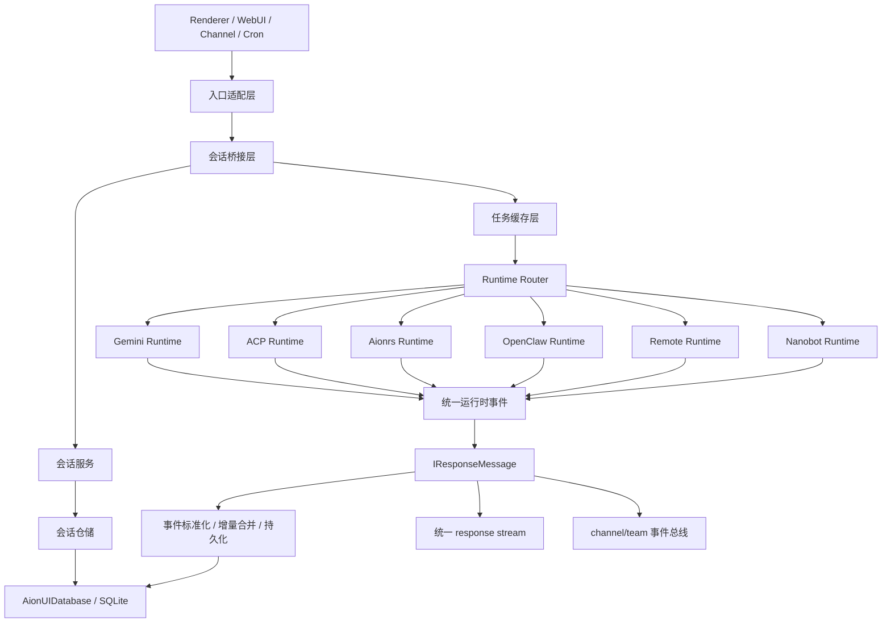

# Conversation Backend Reimplementation README

这份文档的目标不是介绍 UI，而是把 AionUi 当前代码里的“会话后端”完整拆开，给另一个 Codex 作为复刻参考。

为了避免另一个实现被当前仓库的文件组织、类名或函数名绑住，下面尽量只保留必须复刻的语义级内容：

- 会话字段
- 消息类型
- 协议事件
- 状态迁移
- 持久化约束

除这些必须对齐的契约外，其余命名都应理解为“职责描述”，不是必须照搬的源码名字。

目标读者假设：

- 你要在别的代码库里重建 AionUi 的会话后端行为。
- 你关心的是后端真实运行逻辑，而不是页面长什么样。
- 你希望知道哪些行为是主干逻辑，哪些是兼容层、历史遗留、或者当前实现里的已知偏差。

本文基于当前仓库源码整理，优先级按“真实代码路径”而不是旧文档。

## 1. 范围

本文覆盖以下内容：

- 会话对象和消息对象的真实数据结构
- 会话创建、恢复、删除、更新、迁移
- 发送消息、流式回包、确认/审批、停止、kill、重连
- SQLite 持久化、消息合并规则、历史迁移
- 6 类对话后端的行为差异：
  - `gemini`
  - `acp` 家族（含 `claude` / `qwen` / `iflow` / `codebuddy` / `codex` / `custom` 等）
  - `aionrs`
  - `openclaw-gateway`
  - `remote`
  - `nanobot`
- 渠道模式、定时任务、`/btw` side question 对会话后端的复用方式

本文不详细展开：

- renderer 侧布局和组件渲染细节
- Preview/Workspace 面板 UI
- 扩展市场、WebUI 登录、系统设置等非会话核心逻辑

## 2. 一句话总览

AionUi 的会话后端可以抽象成 6 层：

1. 入口层：renderer / WebUI / channel bot / cron / team
2. IPC/bridge 层：把请求路由到主进程服务
3. 会话服务层：创建、更新、迁移、删除 `TChatConversation`
4. 任务层：会话级 runtime 缓存 + 每种后端的会话管理器，负责会话运行时状态
5. 协议适配层：Gemini CLI / ACP / Aionrs / OpenClaw / Remote / Nanobot
6. 持久化层：SQLite conversations/messages/remote_agents + 旧文件存储懒迁移

真正决定行为的核心不是 bridge，而是：

- 会话服务如何创建/更新/删除/迁移 conversation
- 任务缓存层如何复用或重建每个 conversation 对应的 runtime
- 各 backend manager 如何把底层事件转成统一消息流
- 统一消息模型如何做事件标准化 / 增量合并 / 持久化
- 数据库层如何保存 conversations / messages / remote_agents 以及历史迁移状态

## 3. 模块地图

### 3.1 入口与桥接模块

- 统一 IPC 契约：
  - 定义 conversation 相关 provider / emitter
  - 定义 response stream、confirmation、approval、warmup、reload-context 这些接口
- 前端暴露层：
  - 只把 bridge 能力暴露给 renderer
  - 不承载会话业务
- 通用会话桥：
  - create / get / update / remove / send / stop / reset / warmup
- backend 专用桥：
  - Gemini 的特殊确认与流接口
  - ACP/Aionrs/Codex 的模式、模型、CLI 探测、健康检查
  - Remote/OpenClaw 的握手与配置 CRUD
- 数据桥：
  - conversation / message 查询
  - 旧文件存储到 DB 的懒迁移

### 3.2 会话服务与仓储模块

- 会话服务：
  - 负责 conversation 的创建、查询、更新、删除、复制迁移
  - 把 UI/bridge 请求转成真正的会话对象
- 会话仓储：
  - 封装 SQLite 的 CRUD
  - 负责 conversation row / message row 的序列化与反序列化
- 数据库初始化与迁移：
  - 维护 schema version
  - 逐步补齐最终字段集合
- 仓储兼容层：
  - 在 DB 与旧文件存储之间做过渡迁移

### 3.3 任务层 / runtime 管理模块

- 任务缓存层：
  - conversation_id -> runtime task
  - 负责懒加载、缓存、kill、idle cleanup
- manager 基类：
  - 统一发送、停止、销毁、确认、查询确认项等会话级接口
  - 保存会话级运行状态和 approval memory
- 各 backend manager：
  - Gemini manager
  - ACP family manager
  - Aionrs manager
  - OpenClaw gateway manager
  - Remote manager
  - Nanobot manager

### 3.4 协议 / runtime 适配模块

- Gemini：
  - forked worker + Gemini runtime
- ACP：
  - ACP 会话 runtime
  - ACP 连接层
  - ACP 事件适配层
- Aionrs：
  - forked worker + JSON Lines 协议 runtime
- OpenClaw：
  - WebSocket gateway runtime
- Remote：
  - 远程 WebSocket runtime（复用 OpenClaw transport）
- Nanobot：
  - 轻量直接运行时

### 3.5 共享消息模型与中间件

- 消息模型层：
  - `TMessage`
  - `IConfirmation`
  - 运行时事件标准化器
  - 持久化消息合并器
- 消息写入层：
  - DB 写入队列
  - 增量 merge
  - add / addOrUpdate
- 后处理层：
  - think tag 清洗
  - cron command 检测 / 执行
  - skill suggest 检测

## 4. 真实领域模型

### 4.1 会话对象：`TChatConversation`

`TChatConversation` 是整个系统里 conversation 的规范表示。

统一公共字段：

- `id`
- `name`
- `type`
- `extra`
- `createTime`
- `modifyTime`
- `status?: 'pending' | 'running' | 'finished'`
- `source?: ConversationSource`
- `channelChatId?: string`
- `model` 仅部分类型存在

当前真实会话类型：

- `gemini`
- `acp`
- `codex`（遗留）
- `openclaw-gateway`
- `nanobot`
- `remote`
- `aionrs`

当前新增会话时，`codex` 其实不再作为主路径存在：

- renderer/bridge 创建 `codex` 时会被 remap 为 `type: 'acp' + extra.backend: 'codex'`
- 但 DB 类型和部分 channel 逻辑里仍保留 legacy `codex`

这是一个必须知道的兼容点，不然你会看不懂为什么类型系统里还有 `codex`。

### 4.2 每类会话 `extra` 的关键字段

#### Gemini

- `workspace`
- `customWorkspace`
- `webSearchEngine`
- `contextFileName`
- `presetRules`
- `contextContent`（兼容字段）
- `enabledSkills`
- `presetAssistantId`
- `sessionMode`
- `isHealthCheck`
- `cronJobId`

#### ACP 家族

- `workspace`
- `backend`
- `cliPath`
- `customWorkspace`
- `agentName`
- `customAgentId`
- `presetContext`
- `enabledSkills`
- `presetAssistantId`
- `acpSessionId`
- `acpSessionConversationId`
- `acpSessionUpdatedAt`
- `lastTokenUsage`
- `lastContextLimit`
- `sessionMode`
- `currentModelId`
- `isHealthCheck`
- `cronJobId`

#### OpenClaw / Remote

- `sessionKey`
- OpenClaw 还有 `gateway` 配置
- Remote 还有 `remoteAgentId`

#### Aionrs

- `workspace`
- `presetRules`
- `enabledSkills`
- `maxTokens`
- `maxTurns`
- `sessionMode`
- `lastTokenUsage`

### 4.3 运行时流消息：`IResponseMessage`

统一运行时事件模型：

```ts
type IResponseMessage = {
  type: string;
  data: unknown;
  msg_id: string;
  conversation_id: string;
  hidden?: boolean;
};
```

Manager / Agent 不直接向前端发 `TMessage`，而是先发 `IResponseMessage`。

### 4.4 持久化消息：`TMessage`

统一持久化 / UI 消息模型：

核心类型：

- `text`
- `tips`
- `tool_call`
- `tool_group`
- `agent_status`
- `acp_permission`
- `acp_tool_call`
- `codex_permission`
- `codex_tool_call`
- `plan`
- `thinking`
- `available_commands`
- `skill_suggest`
- `cron_trigger`

### 4.5 消息转换和合并规则

#### 运行时事件标准化

输入：运行时事件

输出：持久化/UI 消息或空

关键规则：

- `content` / `user_content` -> `text`
- `error` -> `tips(error)`
- `tool_group` / `acp_tool_call` / `plan` / `thinking` -> 同名 `TMessage`
- `start` / `finish` / `thought` / `system` / `request_trace` / `acp_context_usage` 不落库

#### 增量合并器

这是“为什么流式消息不会无限插入”的关键：

- `tool_group`：按 `callId` merge
- `tool_call`：按 `callId` merge
- `codex_tool_call`：按 `toolCallId` merge
- `acp_tool_call`：按 `update.toolCallId` merge
- `plan`：按 `sessionId` merge
- `thinking`：按 `msg_id` merge，并且 `done` 只更新状态/时长
- 普通 `text`：如果 `last.msg_id === message.msg_id && last.type === message.type`，则拼接内容

如果你要复刻“看起来是连续打字，但 DB 里不是每个 chunk 一条”，这部分必须 1:1 理解。

### 4.6 审批对象：`IConfirmation`

统一确认结构：

- `id`
- `callId`
- `title?`
- `description`
- `action?`
- `options[]`
- `commandType?`

确认消息不等于普通消息：

- 它们走独立确认侧信道
- 多数情况下不持久化到 `messages`
- 确认完成后会从 manager 内存里删除

## 5. 持久化模型

### 5.1 当前存储体系

当前真实存储以 SQLite 为主，旧文件存储只作为懒迁移来源。

核心表：

- `conversations`
- `messages`
- `remote_agents`
- `cron_jobs`
- `teams`
- `mailbox`
- `team_tasks`

会话后端最核心的仍然是前 3 张表。

### 5.2 `conversations` 表

当前逻辑上的字段集合不是只看“初始建表定义”就够了，而是由：

- 基础建表语句
- 历史版本的所有迁移脚本

共同决定。

注意：

- 基础建表只描述“最初状态”
- 当前最终结构依赖所有迁移累计执行到第 22 版
- 新鲜数据库不是一次建表直接达到最终形态，而是“建表 + 逐步迁移”

当前会话行序列化规则：

- `extra` -> JSON string
- `model` -> JSON string
- `source` / `channel_chat_id` 直接列存

### 5.3 `messages` 表

当前消息落库字段：

- `id`
- `conversation_id`
- `msg_id`
- `type`
- `content`（JSON string）
- `position`
- `status`
- `hidden`
- `created_at`

`hidden` 是 v22 新增字段，用于“前端不显示但仍持久化并发送给 agent”的消息。

### 5.4 旧文件存储迁移

懒迁移发生在会话读取和消息读取阶段，由桥接层和迁移工具共同触发。

策略：

1. 先查 DB
2. DB 没有再查旧版文件型会话存储
3. 找到后后台异步迁移到 DB
4. 消息也从旧版文件型消息存储迁移

这意味着当前系统不是纯 DB-only；它带一个过渡兼容层。

## 6. 总体时序



## 7. 核心流程

### 7.1 创建会话

入口：

- UI / WebUI / channel / cron 入口都会汇总到统一的 create provider
- channel 自动建会话
- cron 新建会话执行

主路径：

1. bridge 校验 `type`
2. `codex` 在 bridge 层 remap 为 `acp + backend=codex`
3. 会话服务按 `type` 走对应的会话构造器
4. 构造器负责：
   - 分配 `conversation.id`
   - 构造 workspace
   - 生成 `extra`
   - 对 temp workspace 注入 skill symlink
5. service 会把 `params.id/name/source/channelChatId` 覆盖到最终对象
6. repo 落库

### 7.2 发送消息

统一入口是 conversation 的 `sendMessage` provider。

执行步骤：

1. 根据 `conversation_id` 通过任务缓存层取现有 task 或新建 task
2. 根据 task 类型处理文件：
   - `gemini`：把上传文件复制到 workspace
   - 其他 agent：直接使用绝对路径
3. 如果 `injectSkills` 有值，提前构造增强后的 `agentContent`
4. 调用 `task.sendMessage()`
5. Gemini 文件在 `finish` 后按配置清理

### 7.3 Task 构建

任务构建逻辑很直接：

1. 默认先查内存缓存
2. 缓存 miss -> 从 repo 读 conversation
3. 根据 conversation.type 走中心化 runtime 工厂分发
4. 缓存 task

也就是说 conversation.type -> runtime manager 的映射是中心化注册的，不是由各入口自己散落判断。

### 7.4 运行时事件 -> DB / UI

这是复刻时最重要的真实链路：

1. 底层 agent / worker 发出 `IResponseMessage`
2. AgentManager 决定：
   - 什么消息需要持久化
   - 什么消息只发 UI
   - 什么消息要先做二次转换（thinking、cron、preview、tool approval）
3. 通过事件标准化器转为 `TMessage`
4. 通过新增写入或增量更新策略落库
5. 同时 emit 到：
   - 统一 conversation response stream
   - 某些平台专用 stream
   - team 事件总线
   - channel 事件总线

### 7.5 停止 / kill

有两类停止语义：

#### stop

- 用户想中止当前轮，不一定销毁 agent 进程
- Gemini / Aionrs 会注入历史后停止，保留上下文
- ACP 用 `cancelPrompt()`
- OpenClaw / Remote / Nanobot 调协议层 stop

#### kill

- 彻底销毁运行时实例
- 任务缓存层的 `kill()` 会把 task 从缓存移除
- ACP 会话管理器在 `kill()` 时还会尽力先结束 CLI 子进程，再拆掉 worker
- idle timeout 只对 `acp` 生效（30 分钟无活动 + 非 cron 执行）

### 7.6 恢复 / resume

不同后端恢复策略不同：

- Gemini：
  - 不是协议级 session restore
  - 用 DB 最近 20 条 `text` 拼成 plain history 注回 worker 内存
- ACP：
  - `extra.acpSessionId` + `acpSessionConversationId`
  - Codex 走 `session/load`
  - 其他 ACP 后端主要走 `session/new(...resumeSessionId...)`
- Aionrs：
  - 如果 DB 里已经有消息，则用 `--resume conversation_id`
  - 否则用 `--session-id conversation_id`
- OpenClaw / Remote：
  - 优先 `sessionKey`
  - 否则以 `conversation_id` 为默认 session key 执行 `sessions.reset/resolve`
- Nanobot：
  - 没有复杂恢复模型

## 8. AgentManager 行为矩阵

### 8.1 Gemini

关键模块组成：

- 一个负责生命周期和 DB/stream 协调的 Gemini manager
- 一个长期驻留的 forked worker
- 一个真正执行 Gemini CLI / runtime 行为的 agent 内核

#### 运行结构

- 主进程侧有一个会话管理器
- 该管理器长期持有一个 forked worker
- 真正的 CLI/runtime 内核运行在 worker 内部
- 管理器通过消息传递驱动 worker 执行发送、停止、确认等操作

#### 启动阶段

Gemini 启动时会：

1. 读取 `gemini.config`
2. 读取并过滤 MCP servers
3. 计算 MCP fingerprint
4. 计算 enabled skills（含 builtin）
5. 根据 `sessionMode` / legacy `yoloMode` 算出实际 yolo
6. 启动 worker
7. 从 DB 注入最近 20 条文本历史

#### 发送消息

- 普通消息先插入用户 `text`
- cron 触发消息额外 emit 一条 `user_content`
- 每次发送前检查 MCP fingerprint 是否变化
  - 变化则 `kill + re-bootstrap`

#### 流式事件

Gemini 常见事件：

- `start`
- `content`
- `tool_group`
- `thought`
- `finish`
- `error`

关键附加逻辑：

- 维护 thinking message：单独一条 `thinking` 类型消息，定时 flush 到 DB
- 对 `content` 内嵌 `<think>` 标签做清洗
- `tool_group` 触发确认逻辑
- finish 后会：
  - 检查 cron commands
  - 检查 `SKILL_SUGGEST.md`

#### 审批逻辑

Gemini 有两层自动批准：

1. mode-based
   - `yolo`：全自动
   - `autoEdit`：自动通过 `edit` / `info`
2. 会话级审批记忆表
   - exec 以命令名为粒度
   - edit/info 以动作类型为粒度

#### 重要特点

- yolo 相关能力不能在已启动 worker 上完全热切换，只能在启动时确定
- `stop()` 会先把历史重新注回 worker，再发 stop
- reload context 的本质也是重新注历史，而不是重建协议会话

### 8.2 ACP 家族

关键模块组成：

- 一个负责 session 生命周期与 UI/DB 协调的 ACP manager
- 一个负责 CLI 连接、超时、权限暂停、自动重连的连接层
- 一个把 ACP 原生事件转换成统一消息模型的适配层
- 一个面向会话级 session 的 ACP runtime 内核

#### 覆盖范围

当前 ACP 家族包含：

- `claude`
- `qwen`
- `iflow`
- `codebuddy`
- `codex`
- `custom`
- 以及其他通过 ACP 协议接入的 CLI

#### 启动阶段

ACP 会话启动的真实顺序：

1. 解析 backend / custom agent / cliPath / acpArgs / env
2. 计算 yoloMode / sandboxMode / persistedModelId
3. 建立 CLI 传输连接
4. 完成认证
   - 先尝试直接 resume/new session
   - 如果失败，对 `qwen` / `claude` 做 CLI login warmup
5. 创建或恢复 session
6. 应用 `sessionMode`
7. 应用 model
8. emit `acp_model_info`

#### resume 逻辑

- `extra.acpSessionId` 是恢复关键
- 额外要求 `extra.acpSessionConversationId === current conversation_id`
- Codex 用 `session/load`
- 其他 ACP 主要走 `session/new` 的 resume 参数

#### 发送消息

发送前会做几件额外处理：

1. 立即插入用户消息并 emit `user_content`
2. 若首条消息：
   - 有 native skills 且是 temp workspace -> 只注入 preset rules
   - 否则把 rules + skill index 注入到 prompt
3. 处理上传文件：给内容前面加 `@full-path`
4. 解析消息正文里的 `@` 文件引用并附加文件内容
5. 若用户之前切过模型，发送前重新 assert model
6. Claude 需要对模型切换注入 system reminder
7. 动态重读 prompt timeout 配置

#### 流式事件与适配

ACP 原生事件不会直接给 UI，必须先经过协议适配层：

- `agent_message_chunk` -> `text`
- `agent_thought_chunk` -> `tips(warning)`，然后 manager 再转成 `thought`/`thinking`
- `tool_call` / `tool_call_update` -> `acp_tool_call`
- `plan` -> `plan`
- `usage_update` -> `acp_context_usage`

Manager 侧又做了一层增强：

- `thought` -> `thinking` message
- `tool_call` / `tool_call_update` 聚合
- stream text chunk 先缓冲 120ms 再写 DB
- `available_commands_update` 更新 slash commands 缓存
- finish 时检查 cron commands，并把系统反馈再发给 AI 继续跑

#### 审批逻辑

ACP 有三层审批：

1. `sessionMode` 自带的 yolo / bypassPermissions
2. team MCP 工具自动通过
3. 会话级审批记忆表
   - key = `kind + title + rawInput(command/path/file_path)`
   - 只缓存 `allow_always`

#### stop / kill

- `stop()` = `cancelPrompt()`，保留 session
- `kill()` = 优雅结束 agent + grace period + hard timeout

#### Codex 特别说明

当前 Codex 是“ACP backend 的一种”，不是一套独立 task runtime。

需要保留的特殊行为：

- `conversation.create(type='codex')` 会 remap 到 `acp + backend=codex`
- `setMode()` 对 codex 不走 ACP `session/set_mode`，只更新本地状态 + sandbox mode
- model info / config 仍通过 ACP bridge 获取

### 8.3 Aionrs

关键模块组成：

- 一个 Aionrs manager
- 一个长期驻留的 worker
- 一个面向 Rust 二进制的 JSON Lines runtime

#### 运行结构

- manager 是 forked worker
- worker 内部跑 Rust `aionrs` 二进制
- 协议是 JSON Lines：
  - stdout 事件
  - stdin 命令

#### 启动阶段

- 先 resolve bundled/system `aionrs` binary
- 根据 provider 生成 CLI args/env
- 写入临时 `.aionrs.toml` 做兼容覆盖
- 如果 DB 已有消息，`--resume conversation_id`
- 否则 `--session-id conversation_id`
- `ready` 事件成功后，如有 `presetRules` 再注入 history

#### 事件映射

原生事件：

- `ready`
- `stream_start`
- `text_delta`
- `thinking`
- `tool_request`
- `tool_running`
- `tool_result`
- `tool_cancelled`
- `stream_end`
- `error`
- `info`

映射后：

- `text_delta` -> `content`
- `thinking` -> `thought`
- `tool_*` -> `tool_group`
- `stream_end` -> `finish`

#### 模式

- `default`
- `autoEdit`
- `yolo`

`autoEdit` 会自动批准 `edit` 和 `info`，`yolo` 全通过。

#### 审批 store

- `exec`：按 root command
- `edit` / `info` / `mcp`：按动作种类

### 8.4 OpenClaw Gateway

关键模块组成：

- 一个在主进程里直接持有 runtime 的 manager
- 一个 WebSocket gateway runtime

#### 运行结构

- 不走 forked worker
- manager 在主进程里直接持有运行时对象
- 运行时对象内部通过 WebSocket 建立 gateway 连接
- 可以连接本地 gateway，也可以 `useExternalGateway`

#### session 策略

- 优先 `extra.sessionKey`
- resume 失败则以 `conversation_id` 为 key 做 `sessions.reset` 或 `sessions.resolve`

#### 流式文本恢复是三层 fallback

这是 OpenClaw/Remote 最值得保留的行为：

1. `chat:delta` 正常流
2. 若 delta 丢了，`chat:final.message` 补齐
3. 若 final 也没有正文，则回查 `chat.history`

此外还保留了 `agent.stream='assistant'` 文本作为中间 fallback buffer。

#### 工具 / 审批

- `agent.tool` / `agent.tool_call` 被转成 ACP 风格 `ToolCallUpdate`
- `exec.approval.request` -> `acp_permission`
- 当前审批请求会发 UI，但 approval memory 逻辑不完整

### 8.5 Remote

关键模块组成：

- 一个 remote manager
- 一个 remote runtime core
- 一个负责远程配置和握手的 bridge/service 层

#### 本质

Remote 不是一套全新协议实现，它本质上是：

- 复用 OpenClaw 那套 WebSocket transport
- 但不启动本地 gateway 进程
- 连接信息来自 `remote_agents` 表，而不是本地 gateway 配置文件

#### 远程配置

`remote_agents` 表保存：

- `url`
- `authType`
- `authToken`
- `allowInsecure`
- OpenClaw 设备身份字段
- `deviceToken`
- `status`
- `lastConnectedAt`

敏感字段会加密后存库。

#### 握手

远程握手步骤仅在配置阶段调用，用于：

- 探测可连通性
- 处理 OpenClaw pairing / pending approval
- 落库 device token

#### 运行时会话

运行时 remote core 和 OpenClaw 很像：

- 同样是 `sessionsResolve` / `sessionsReset`
- 同样是三层文本 fallback
- 同样是 agent/tool/chat 事件拆分

但注意当前实现里 Remote 权限处理是简化版：

- `pendingPermissions` 的 resolve/confirm 逻辑比 ACP/OpenClaw 更弱
- 会话级审批记忆表也没有真正完整接通

复刻时如果你要“完全一致”，应保留这个现状；如果你要“修正”，要明确说明你是在升级行为，不是在复刻。

### 8.6 Nanobot

关键模块组成：

- 一个轻量 manager
- 一个 fire-and-forget 风格的 runtime

特点最简单：

- 不走 fork
- 直接持有轻量运行时对象
- `sendMessage()` fire-and-forget，不等待 CLI 完成
- 依赖异步 stream/signal 事件回写 UI
- 没有复杂 mode/model/session restore

## 9. 额外复用入口

### 9.1 Channel 模式

关键模块组成：

- 外部平台消息入口
- channel 会话查找/创建层
- channel stream 消费层

复用方式：

1. 外部平台消息进来后，按 `source + channelChatId + convType (+ backend)` 查找会话
2. 没有就自动建 conversation
3. 发送时通过任务缓存层取或建会话 runtime，并强制启用 yoloMode
4. 流式回包不直接读 DB，而是靠 channel 事件总线 + 事件标准化 + 增量合并

重点：

- channel bot 会自动启用 yolo
- conversation 以 `source + channelChatId` 做隔离

### 9.2 Cron 模式

cron 对会话后端的复用体现在两层：

1. cron executor 可以复用旧 conversation，也可以 spawn 新 conversation
2. manager finish 后会额外跑：
   - cron command 检测
   - `SKILL_SUGGEST.md` 检测

这意味着 AI 输出不是单纯文本，它还能在消息里内嵌：

- `[CRON_CREATE]...[/CRON_CREATE]`
- `[CRON_LIST]`
- `[CRON_DELETE: xxx]`

系统会解析这些命令，执行后再把系统反馈喂回 AI。

### 9.3 `/btw` side question

关键模块组成：

- 一个 side question service
- 一个受限工具能力的短生命周期 fork session

当前仅对部分 ACP 场景支持，实际代码只给 `claude + acpSessionId + workspace` 这条路径开了 fork session side question。

行为：

- fork 一个 ACP session
- 禁用工具
- 问一个简短 side question
- 如果 agent 还是试图调工具，则返回 `toolsRequired`

## 10. 你必须保留的行为约束

下面这些不是“实现细节”，而是 AionUi 会话后端的关键契约：

1. `IResponseMessage` 才是运行时统一事件，`TMessage` 是 UI/DB 层表示。
2. 流式文本不能每个 chunk 都直接插入 DB，必须按 `msg_id` 合并。
3. 不是所有事件都持久化；`start/finish/system/request_trace/acp_context_usage` 主要是运行时信号。
4. 用户消息必须在真正发送给 agent 之前先落库，这样 UI 不等后端初始化。
5. 会话排序依赖 `modifyTime`；发送消息时通常会显式触发一次 conversation update。
6. `Gemini` 的恢复依赖“注入最近文本历史”，不是协议级 session resume。
7. `ACP` 的恢复依赖 `acpSessionId`，并且要校验 session 所属 conversation。
8. `OpenClaw/Remote` 的文本恢复必须保留 fallback 链，不然会出现 final 无正文时丢回复。
9. 审批缓存是会话级内存，不是全局持久化。
10. `codex` 现在实质上走 ACP 路径，但 legacy `codex` 类型仍需兼容。
11. temp workspace 会自动建 skill symlink；custom workspace 通常改为 prompt 注入。
12. channel 模式和桌面模式不是两套会话后端，它们复用同一套 task/db，只是入口和 stream 消费者不同。
13. cron/skill-suggest 是对 assistant 最终输出的二次解释层，不在 LLM runtime 内部。
14. DB 当前最终结构依赖 migration 到 v22，不能只抄 `schema.ts`。
14. DB 当前最终结构依赖所有迁移累计到第 22 版，不能只照着初始建表定义实现。
15. `hidden` 消息是有效状态，不能当成普通消息丢掉。

## 11. 当前代码中的遗留/偏差

这些是你在复刻时应明确区分的点：

1. 系统里已经预留“本轮完成”事件，但当前各后端管理器并没有稳定发出它。
2. `codex` 创建路径已转 ACP，但部分 channel helper 仍保留 `convType: 'codex'` 视角。
3. `OpenClaw` / `Remote` 的 approval memory 逻辑没有 ACP/Gemini/Aionrs 那么完整。
4. 基础建表定义不是最终 schema，它只是迁移起点。
5. 旧文件存储仍然存在，数据库桥接层会做 lazy migration。

## 12. 复刻建议顺序

如果另一个 Codex 要从零复刻，建议按这个顺序做：

1. 先实现统一数据模型：
   - `Conversation`
   - `ResponseEvent`
   - `PersistedMessage`
   - `Confirmation`
2. 实现 SQLite conversations/messages/remote_agents
3. 实现运行时事件标准化 + 增量合并写库 + 新增/更新策略
4. 实现会话服务
5. 实现“任务缓存层 + runtime 工厂 + manager 基类”
6. 先接一个最简单的 backend（推荐 `aionrs` 或 `nanobot`）
7. 再接 `gemini`
8. 再接 `acp`
9. 最后补 `openclaw` / `remote` 的 WebSocket session/fallback 细节
10. 再补 channel/cron/side-question 这些“复用入口”

## 13. 最小复刻清单

如果你的目标是“行为上和 AionUi 当前后端一致”，那么至少要做到：

- 会话创建/更新/删除/查询
- 懒加载并缓存 task
- 用户消息先落库再发送
- 流式文本按 `msg_id` 合并
- tool_group / plan / thinking 合并逻辑
- stop vs kill 语义分离
- 每种后端自己的 resume 策略
- 会话级 approval memory
- cron command 后处理
- channel yolo + per-chat isolation

## 14. 产品级补充：CLI 自选、稳定连接、流式思考、后台常驻、Skill/MCP 封装

这一节专门回答“怎样把命令行代理完整封装进聊天窗口”。

如果你要让另一个 Codex 真正做出“像命令行，但默认藏在好前端里，想展开时又能看到全过程”的产品，这一节比前面的纯后端总览更重要。

### 14.1 这一层你还必须看哪些前端文件

前面的大部分内容聚焦主进程和任务层，但你现在要复刻的是“产品能力”，所以前端至少还要有下面这些模块：

- 消息归并层：
  - 持续消费 response stream
  - 在前端本地按 `msg_id / callId / toolCallId` merge
- 平台流监听层：
  - 针对 Gemini、ACP 等不同 backend 管理 running / waiting / thought / token usage 状态
- 消息渲染层：
  - `text`
  - `thinking`
  - `tool_group`
  - `acp_tool_call`
  - `plan`
  - `tips`
  - `skill_suggest`
  - `cron_trigger`
- 审批 UI 层：
  - 独立监听 `confirmation.add/update/remove/list/confirm`
- 工作区/预览联动层：
  - 在工具调用期间刷新 workspace tree
  - 在导航类工具调用时打开 preview 面板
- 引导页选择层：
  - 可用 agent 探测结果展示
  - 上次选择恢复
  - 发送前 fallback

换句话说：

- 主进程决定“代理怎么跑”
- renderer 决定“用户感觉自己是不是在一个增强版命令行里”

两边缺一边，都会复刻不完整。

### 14.2 如何自动选择 CLI / Agent

当前代码不是“拍脑袋选一个 CLI”，而是一个分层选择流程。

#### 第 1 层：检测本机可用 CLI

关键不是“某个 detector 文件”，而是一套分层数据来源：

- 一张 backend 元信息表
- 一个环境探测器
- 一个把探测结果暴露给前端的 provider

真实逻辑：

1. `ACP_BACKENDS_ALL` 定义所有内置 backend 的元信息：
   - `cliCommand`
   - `acpArgs`
   - 是否启用
   - 默认显示名
2. `POTENTIAL_ACP_CLIS` 从 `ACP_BACKENDS_ALL` 自动生成“可检测 CLI 列表”。
3. `AcpDetector.initialize()` 启动时遍历这个列表：
   - macOS/Linux：`which`
   - Windows：先 `where`，失败再走 PowerShell `Get-Command`
   - 环境变量不是裸 `process.env`，而是增强过 PATH 的 `getEnhancedEnv()`，这样能找到用户 shell 里的 `~/.local/bin` 一类路径
4. 检测成功后写入内存 `detectedAgents`

必须注意的现状：

- `gemini` 会被**无条件加入**候选列表，作为内置默认项，不依赖本地 `which gemini`
- `aionrs` 不走 ACP detector，而是在 bridge 层单独用 `detectAionrs()` 注入
- 扩展贡献的 ACP adapter 会热插入列表
- 用户自定义 agent 也会追加到候选列表末尾

也就是说，AionUi 的“自动选择 CLI”前提不是只看系统 PATH，而是先构造一个“当前环境可用 agent 清单”。

#### 第 2 层：前端选择当前 agent

这一层的本质是“选择状态机”，不是某个页面 hook。

当前选择顺序：

1. 先读 `guid.lastSelectedAgent`
2. 如果这个 agent 现在还可用，就继续用
3. 如果不可用，则退回 `availableAgents[0]`
4. `defaultAgentKey` 实际上是“第一个非 preset CLI agent”，默认兜底是 `aionrs`

#### 第 3 层：preset assistant 的主 agent 不可用时自动回退

这一层的本质是“发送时决策”，不是渲染时决策。

这一步非常关键。

当前代码的真实策略不是在 Guid 页上立刻强制切换，而是：

1. 先根据 preset assistant 的 `presetAgentType` 算出它理论上应该走哪个 backend
2. 发送时再检查这个主 agent 是否可用
3. 如果不可用，再调用 `getAvailableFallbackAgent()` 找一个当前可跑的 fallback
4. 创建 conversation 时用 fallback backend

这意味着：

- “自动选择 CLI”在 AionUi 里本质上是“检测可用 agent + 保留用户偏好 + 发送时做最后回退”
- 它不是一个单独的 service，而是 detector、Guid 页状态、send 阶段共同组成的

#### 第 4 层：模型层面的自动补全

还有一个容易忽略的点：CLI 选中后，模型列表也不是固定死的。

当前做法：

- ACP agent 的模型信息可通过 `probeModelInfo` 预探测
- Codex 在 Guid 页第一次被选中时，会主动 `probeModelInfo`
- 结果缓存到 `acp.cachedModels`
- 用户选过的模型单独存 `preferredModelId`

所以如果另一个 Codex 要复刻“自动可用”体验，最少要做这四件事：

1. 检测可运行 backend
2. 记住上次用户选择
3. 发送前做 availability fallback
4. 预探测并缓存模型列表

### 14.3 如何与 CLI 后端形成稳定连接

#### ACP / Codex 这条线

核心不是文件组织，而是三层职责：

- 会话级 manager
- CLI 连接层
- ACP 运行时内核

稳定连接不是“spawn 子进程然后 send prompt”这么简单，AionUi 做了很多防抖和恢复。

真实启动链路：

1. `WorkerTaskManager.getOrBuildTask()` 复用已有 task；没有才新建
2. `AcpAgentManager.initAgent()`
3. `AcpAgent.start()`
4. `AcpConnection.connect()`
5. `initialize`
6. `authenticate`
7. `createOrResumeSession()`
8. 应用 `sessionMode`
9. 应用模型
10. emit `session_active`

要复刻稳定性，下面这些逻辑必须保留：

- **连接超时保护**
  - Codex 连接超时 150s
  - 其他 ACP 默认 70s
- **首连失败自动重试一次**
  - `AcpAgent.start()` 里第一次连接失败会短暂 backoff 后再连一次
- **npx 缓存修复**
  - `AcpConnection.connect()` 会识别 `notarget` / `_npx` 缓存损坏
  - 必要时自动清理 npm cache 或 `_npx` 缓存，再重试
- **silent tool keepalive**
  - `session/prompt` 发出后会启动 keepalive
  - 即使长时间没有 stream chunk，只要 CLI 进程还活着，也会重置 prompt timeout
  - 这样长时间跑测试、构建、命令时不会被误判超时
- **权限确认时暂停 timeout**
  - `handlePermissionRequest()` 会暂停所有 `session/prompt` timeout
  - 用户确认后再恢复
- **异常断线后的自动重连**
  - `AcpAgent.sendMessage()` 如果发现 connection 或 session 已失效，会先 `start()` 再发 prompt

一句话概括：AionUi 不是“每轮消息启一个 CLI”，而是“每个 conversation 持有一个可恢复的 CLI session，send 时优先复用”。

#### OpenClaw / Remote 这条线

核心是“WebSocket session runtime + 会话恢复逻辑”。

这两条不是 stdio JSON-RPC，而是 WebSocket session。

稳定性的关键是：

- `waitForConnection()` 等到 socket 真连上
- `resolveSession()` 恢复或重置 session key
- `sendMessage()` 发现未连接时自动 `start()`
- 断线时发 `finish`，避免前端永远卡在 loading

#### Gemini / Aionrs 这条线

它们虽然不是 ACP，但也是常驻 runtime，不是每轮冷启动：

- Gemini：
  - manager 启动 forked worker
  - worker 初始化后长期驻留
  - MCP 配置变化时才 `kill + re-bootstrap`
- Aionrs：
  - manager 对应一个持续 worker / binary session
  - stop 时保留上下文，kill 时才彻底结束

### 14.4 如何重新加载对应对话

这里有 3 种不同含义，不能混：

1. **页面切回某个 conversation**
2. **runtime 断了但 conversation 还在**
3. **协议层恢复到之前 session**

#### 页面切回 conversation

当前策略：

- conversation 和 messages 永远以 DB 为主
- 页面切回来时，前端先从 DB 读历史
- 真正需要发消息时，主进程再 `getOrBuildTask()`

所以“切回对话”不要求 CLI 一直在线；要求的是：

- conversation extra 里保存了足够的恢复元数据
- 消息历史已经落库

#### runtime 断了后的重建

如果 runtime 已被 kill 或进程重启：

1. 任务缓存 miss
2. 从 DB 取 `TChatConversation`
3. 重新 new 对应 AgentManager
4. manager 根据 `extra` 决定 resume 方式

#### 各 backend 的恢复策略

必须按 backend 分开实现：

- Gemini：
  - 不做协议级 session restore
  - `reloadContext()` / `injectHistoryFromDatabase()` 把最近 20 条文本重新注入 worker 内存
- ACP：
  - `extra.acpSessionId` 是关键
  - 还要校验 `extra.acpSessionConversationId === current conversation_id`
  - `codex` 用 `session/load`
  - `claude` / `codebuddy` 用 `session/new + _meta.resume`
  - 其他 ACP 用 `session/new + resumeSessionId`
- Aionrs：
  - DB 有消息就 `--resume conversation_id`
  - 没消息就 `--session-id conversation_id`
- OpenClaw / Remote：
  - 优先 `sessionKey`
  - 失败后用 `conversation_id` 兜底 reset/resolve

还有两个重建触发器必须知道：

- `conversation.warmup`
  - 可以提前把 task/bootstrap 启起来，减少首条消息冷启动时间
- `conversation.update(modelChanged)`
  - 模型切换会主动 `kill` task，让下一轮按新模型重建

### 14.5 如何做到“不是等全部回答完才传回来”，而是流式沟通 + 可展开思考

这是 AionUi 最像“命令行代理 UI”而不是普通聊天框的地方。

#### 运行时统一协议：先发事件，不等最终消息

统一约束是：

- 底层 runtime 发的是 `IResponseMessage`
- 前端监听的是 `responseStream`
- DB/UI 再把它变成 `TMessage`

也就是说，前端不是等 “final answer string”，而是持续消费这些事件：

- `start`
- `thought`
- `thinking`
- `content`
- `tool_group`
- `acp_tool_call`
- `agent_status`
- `finish`
- `error`

#### “思考过程可展开”不是 CLI 原生消息，而是 manager 合成出来的

核心不是某个组件名，而是：

- 后端把 `thought` 聚合成统一 `thinking`
- 前端把 `thinking` 当成独立消息类型渲染
- UI 对 `thinking` 做可折叠展示

真实做法：

1. 底层如果发 `thought`
2. manager 把它转成统一 `thinking` 事件
3. 一个 turn 内复用同一个 `thinking msg_id`
4. 每 120ms flush 一次到 DB
5. 前端按 `msg_id` 持续 merge
6. thinking UI 默认在运行中展开，结束后自动折叠

也就是说，“点击展开看思考过程”这件事依赖的是：

- 后端持续发 `thinking`
- 前端把 `thinking` 当成独立 message type
- UI 上做一个可折叠组件，而不是把思考文本混进正文

Gemini 和 ACP 还都做了 `<think>` / `<thinking>` 标签剥离：

- 思考内容单独进 `thinking`
- 正文 `content` 被清洗后再显示

所以如果另一个 Codex 要复刻这个体验，必须把“思考”和“正文”拆成两条流，而不是一个 markdown string。

#### 流式正文怎么合并

正文也不是每个 chunk 一条消息。

关键规则：

- 前端和后端都必须共享同一套 merge 语义

规则如下：

- `text` 按 `msg_id` 追加内容
- `thinking` 按 `msg_id` 追加内容
- `tool_group` 按 `callId` merge
- `acp_tool_call` 按 `toolCallId` merge
- `plan` 更新同一个 session/消息

ACP 还额外做了一层 `120ms` 文本缓冲写库，避免 DB 被超高频 chunk 打爆。

#### 工具执行过程怎么“像命令行步骤面板”

核心不是某个消息组件，而是“工具事件 -> 步骤摘要 -> 可展开的输入/输出/变更面板”这条展示链。

当前体验是：

- 聊天主流里显示一个 “View Steps”
- 展开后看到每一步 tool：
  - 状态
  - 输入
  - 输出
  - diff / 文件变化
- 正在运行的 tool 默认更容易展开

这就是“把命令行里一大串工具过程，封装成一个可折叠步骤面板”。

#### 权限确认也不是等最终结果，而是中途插入 side-channel UI

核心是“confirmation side channel”，而不是把权限请求当普通聊天消息渲染。

这点非常重要：

- 权限确认多数不走普通消息流落库
- 而是走 `confirmation.add/update/remove/list/confirm`
- 前端单独渲染一个确认层

所以如果你只复刻 `responseStream`，没有复刻 `confirmation.*`，MCP/exec/edit 权限在 UI 上会“假死”。

#### 有些事件是故意不直接显示在聊天流里的

当前代码里这些是刻意降噪的：

- `available_commands`
  - `transformMessage()` 直接不落为普通 chat message
  - ACP 改成 `slash_commands_updated` 事件，前端再单独拉 slash commands
- `request_trace`
- `acp_context_usage`
- `system`
- `hidden` message

这意味着 AionUi 不是“把 CLI 所有 stdout 都糊到聊天窗里”，而是：

- 关键过程流式展示
- 低信噪比状态用 side channel 或 metadata 承载

### 14.6 如何让 CLI 在后台常驻，而不是每轮重新起

核心是三层抽象：

- 任务缓存层
- manager 基类
- conversation bridge 入口

当前的“常驻”机制很明确：

1. 每个 conversation 对应一个 task/manager
2. `WorkerTaskManager` 把它缓存在内存里
3. 后续消息优先复用这个 task
4. `stop()` 只停当前 turn，不销毁 runtime
5. `kill()` 才真正销毁 runtime 并从缓存移除

因此你想要的“对话框里完成命令行里所有能做的事”，底层前提就是：

- 这个 conversation 背后必须有一个长期存在的 runtime
- 它要保留 session / cwd / skill context / approval memory / model selection

#### 当前哪些情况会结束常驻 runtime

- 用户显式删除 conversation
- 用户 `reset`
- 模型切换触发 `kill` 后重建
- Gemini 的 MCP 配置变化触发 `kill + re-bootstrap`
- ACP 空闲超过 30 分钟触发 idle timeout

注意：

- idle timeout 现在只对 `acp` 做
- `gemini` / `aionrs` / `openclaw` / `remote` 不走这个 30 分钟清理策略

#### 为什么 stop/kill 必须分开

如果不分开，就做不出“像命令行那样，一个会话里连续工作”的体验。

当前语义：

- `stop`
  - 停当前轮生成
  - 保留 session 和 worker/connection
- `kill`
  - 彻底结束这个 runtime
  - 下次发消息需要重连 / 重建 / 恢复

这正是命令行代理 UI 最关键的抽象之一。

### 14.7 如何把 skill、MCP、权限、工作区、预览都封进聊天窗口

如果你的目标是“聊天窗口基本覆盖 CLI 里的全部能力”，你至少要复刻下面 5 个子系统。

#### 1. Skill 发现 / 注入

当前代码不是所有 backend 都用同一种 skill 方案。

Gemini：

- 倾向原生发现
- workspace 里有 builtin/user skills 目录
- manager 启动时把 enabled skills 交给 worker
- 还支持输出后检测 `[LOAD_SKILL: ...]` 再把 skill 内容回喂给模型

ACP：

- 如果 backend 支持 native skill discovery 且 workspace 是 temp workspace：
  - 主要靠 workspace symlink / 原生发现
- 如果是 custom workspace 或 backend 不支持：
  - 首条消息时把 rules + skills index 注入 prompt

OpenClaw / Remote：

- 当前走 `agentContent`
- 倾向把更完整的 skill 内容直接注入给 agent
- 原因是它们不像 ACP/Gemini 那样稳定依赖本地 skill 目录自发现

所以“聊天窗里能调用 skill”不是一句“把 SKILL.md 发进去”就够了，而是要按 backend 区分：

- 原生发现
- 首条 prompt 注入
- 运行中按需加载

#### 2. MCP server 装载

Gemini：

- 从 `mcp.config` + extension MCP servers 合并
- 只使用 `enabled && connected`
- 算 fingerprint
- 运行中配置变化就重建 worker

ACP：

- session 建立时会注入 session MCP servers
- 还有 team MCP / builtin MCP 注入路径
- `available_commands_update` 也会随 session 更新出来

如果要复刻 MCP，请不要只做“把 MCP 配置存起来”。
你还必须做：

- session 启动时实际把 MCP 传给 agent
- 配置变化时让运行中的会话感知
- 权限确认和 always-allow 记忆

#### 3. 权限确认与 always allow

核心是“会话级 approval store + confirmation side channel + 可选自动确认”。

关键事实：

- approval memory 是**会话级内存**
- 不是全局数据库
- 只缓存 `allow_always`
- 不同 backend key 粒度不同

当前封装方式是：

1. runtime 发权限请求
2. manager 转成 `confirmation`
3. 前端展示确认卡
4. 用户选 once / always / cancel
5. backend confirm 后可把 always allow 记进 approval store

Gemini / Aionrs 前端还会先问后端 `approval.check`，如果已经 always allow，则直接自动确认，不再打断用户。

#### 4. 工作区联动

核心是“工具事件驱动 workspace 刷新”，而不是用户手动刷新文件树。

当前产品体验不是“AI 改了文件，用户自己手动刷新树”。

而是：

- `tool_group` / `tool_call` / `acp_tool_call` 到来时
- workspace tree 自动节流刷新

所以想做成命令行代理 UI，聊天区之外还要有：

- workspace tree
- diff 预览
- 文件变更摘要

否则用户虽然能看到工具调用，但感知不到工作区状态在变化。

#### 5. 预览/浏览器工具联动

核心是“导航类工具被识别后，不直接把结果当文本显示，而是转成 preview_open 事件”。

当前实现会拦截导航类 tool，例如 browser / chrome-devtools 打开的 URL：

1. tool 调用被识别为 navigation tool
2. 后端发 `preview_open`
3. front-end 打开 Preview 面板

这就是“命令行里浏览器工具输出的内容，在聊天产品里被折叠成 preview 面板”的做法。

### 14.8 如果你要 1:1 做出这个产品，前端最小职责是什么

另一个 Codex 至少要把前端壳子做到下面这些：

1. 同时监听：
   - `conversation.responseStream`
   - backend 专用 stream（如 ACP/Gemini/OpenClaw）
   - `conversation.confirmation.*`
2. 前端本地做 message merge：
   - `msg_id`
   - `callId`
   - `toolCallId`
3. `MessageList` 里按 message type 分组件渲染：
   - `text`
   - `thinking`
   - `tool_group`
   - `acp_tool_call`
   - `plan`
   - `tips`
   - `cron_trigger`
   - `skill_suggest`
4. `thinking`、tool steps、diff、permission 都要可折叠/可展开
5. `hidden` 不显示，但不能丢
6. 工作区和 preview 面板要订阅工具事件联动刷新
7. slash commands 不一定显示成 chat message，但要能在输入框联想里使用

如果只做一个普通 markdown 聊天窗，你最多只能复刻“最终回复”。

如果把这些 side panel / side channel / collapsible steps 一起做出来，用户才会感觉自己拿到的是“有命令行内核的对话式 IDE 代理”。

## 15. 最后一句

如果只看 bridge，你复刻出来的会是“一个能聊天的壳”。

如果把“会话服务 + 任务缓存 + backend manager + 消息合并规则 + cron/approval/session restore”这一整层一起复刻，才会接近 AionUi 现在真正的后端行为。
